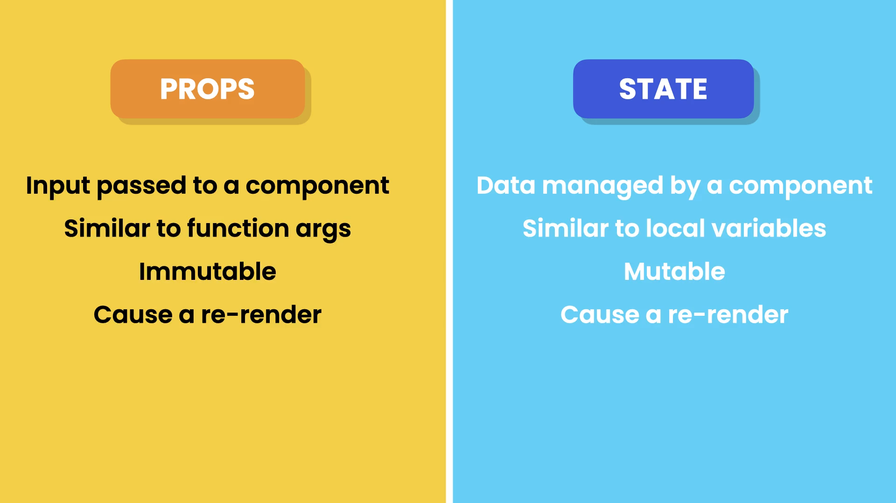

# Lets Learn React

### Fragments?

In react, Components are return a single elements, if you want to return more than one elements there we use fragments.A common pattern in React is for a component to return multiple elements. `Fragments let you group a list of children without adding extra nodes to the DOM.`

### Rendering List

Suppose, You have a list of items and you want to display them in react, Here we cant use the `for...in` or `for...of` here we use functional programming like map, filter or reduce

### Conditional Rendering

In react, Suppose you want to display some values based on conditions or simply a variable inside a JSX(javascript XML) you have to use `{}`.

### Handling Events

For handling events, Inside an JSX elements we have the attribute called `onClick = {pass the function}` for click events and other handling events are also there. and using `event` argument we get a `BaseEvent` object that contains all properties.

### Managing State

If we use a variable to change the state or updating the variable it won't work. In react, variable is a local scope don't have access to the variable like its only perform read operation so, for this reasons we use hooks
`Hooks? Hook is a special kind of function that allows you to use react features in a function based components, so before hooks you can use this features in a class component. so hooks allows you to reuse stateful logic across multiple component without changing the hierarchy or using higher order components, if you use same components also they have independnt states`
So now next thing is what is state management?
`State management is nothing but a way to manage the data or state based on the events or user actions Ex:. I'm clicking a button so based on this event now my current state would be +1`
So for managing state we use useState hook?
`useState? useState hooks helps to manage state, useState function returns an array with two element 1. the current state value 2. a function to update state`

Note: Every component has different state, if i use same component also there behaviour will be different.

### Passing data via props

`Props(properties) are just the inputs/data for components using props we make the component reusable.`

1. First declare the interface for the components --> interface are just the blueprints that define the structure(a shape) of objects, functions and other data types. In simple words it just an object that tells this type of properties are accepted by the component.

2. Pass the properties from where you call this component as a attribute or properties.
   This way you can pass the props
   `<ListGroup fruits={fruits} heading={"List Of Fruits"} />`

### Passing function to props

Add interface to existing Props interface `onSelectFruit: (fruit: string) => void;` its a props property and the pass to the component.

### props vs state

