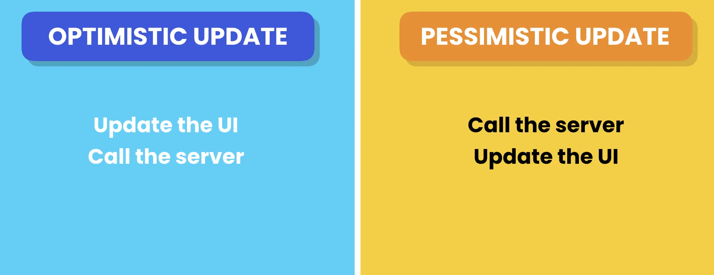

# Lets Learn React

### Fragments?

In react, Components are return a single elements, if you want to return more than one elements there we use fragments.A common pattern in React is for a component to return multiple elements. `Fragments let you group a list of children without adding extra nodes to the DOM.`

### Rendering List

Suppose, You have a list of items and you want to display them in react, Here we cant use the `for...in` or `for...of` here we use functional programming like map, filter or reduce

### Conditional Rendering

In react, Suppose you want to display some values based on conditions or simply a variable inside a JSX(javascript XML) you have to use `{}`.

### Handling Events

For handling events, Inside an JSX elements we have the attribute called `onClick = {pass the function}` for click events and other handling events are also there. and using `event` argument we get a `BaseEvent` object that contains all properties.

### Managing State

If we use a variable to change the state or updating the variable it won't work. In react, variable is a local scope don't have access to the variable like its only perform read operation so, for this reasons we use hooks
`Hooks? Hook is a special kind of function that allows you to use react features in a function based components, so before hooks you can use this features in a class component. so hooks allows you to reuse stateful logic across multiple component without changing the hierarchy or using higher order components, if you use same components also they have independnt states`
So now next thing is what is state management?
`State management is nothing but a way to manage the data or state based on the events or user actions Ex:. I'm clicking a button so based on this event now my current state would be +1`
So for managing state we use useState hook?
`useState? useState hooks helps to manage state, useState function returns an array with two element 1. the current state value 2. a function to update state`

Note: Every component has different state, if i use same component also there behaviour will be different.

### Passing data via props

`Props(properties) are just the inputs/data for components using props we make the component reusable.`

1. First declare the interface for the components --> interface are just the blueprints that define the structure(a shape) of objects, functions and other data types. In simple words it just an object that tells this type of properties are accepted by the component.

2. Pass the properties from where you call this component as a attribute or properties.
   This way you can pass the props
   `<ListGroup fruits={fruits} heading={"List Of Fruits"} />`

### Passing function to props

Add interface to existing Props interface `onSelectFruit: (fruit: string) => void;` its a props property and the pass to the component.

### props vs state


### passing children

Passing children to the component via props
suppose if you have very length content to pass as a text or anything there we use this interface

`interface Props {
  children: ReactNode;
}`

### Vanilla CSS

1. Create a .css file beside to component file(for best practice)
2. import it to the component

### CSS-Modules

When writing vanilla css suppose we have two files with same class name , then there is chances for name clashes, So how do we make it local scope? `Using CSS modules`

1. For making css modules add .module in a file Like: `example.module.css` here, try to use the camel casing
2. Import like this `import style from './example.module.css'`
3. in className : `style.cssSelector or style['css-selector']` its like accessing object
4. optional, if you have more classes then use `[style.cssSelector, style.cssSelector].join(' ')`

### styles components

Using styling to the same file using styled-component library

1. Install `npm i styled-components` if compilation error is there from Typescript then install typed `npm i @typed/style-components`
2. import `import style from 'style-components'`
3. Create an style component object
   Ex (11--> for this think as a backticks )
   `const List = style.ul 1 <Your Style> 1`
4. then use it as a component
   `<List><Your Elements></List>`

### Seperation of concerns

- Divide a Programme into distinct section where each section handles a specific fuctionality, rather than having everything in one place.

### inline styles

1. use it as a prop like: `style={{backgroundColor='yellow'}}` This considered as bad practice.

### Popular UI Libraries

1. Bootstrap
2. Material UI
3. Shadcn/UI
4. Chakra UI
5. Tailwind CSS

### Adding Icons

1. install package `npm i react-icons@4.7.1`
2. go to website [React Icons](https://react-icons.github.io/)
3. import `import { IoIosCalendar } from "react-icons/io";`
4. `<IoIosCalendar />`

### understanding the state hook

- React Updates state asynchronously, i.e Not immediately because every time state changed component is going to be re-render So for example: `suppose In a function we write the logic that change the 4 states on a click event, so if the upates are immediate then component will re-render 4 to 5 times, FOR THAT REASON ITS ASYNCHRONOUS.`

- State is stored outside of a component, why? because if you think the scope of a variable in a js its a blocked scoped, for that reason it stored on memory until the component is on the screen.

- Use hooks at the top level of your component. This adheres to the React's guidelines for using hooks.

### choosing the state structure(Best Practice)

- Avoid redundant state variable
- Group related variables inside an object
  `const [person, setPerson] = useState({firstName: ''; lastName:'';})`
- Avoid deeply nested structure

### Keeping Components pure

In the context of React, keeping components pure refers to adhering to the principles of functional programming by ensuring that components are stateless and do not have side effects. This means that given the same input, a pure component will always produce the same output, and it does not modify anything outside of its scope.

Here are some key aspects of keeping components pure in React:

1. Statelessness: Pure components do not manage their own state. They receive data and behavior as props from their parent components and simply render based on those props. This makes them easier to reason about and test because their output is solely determined by their input props.

2. Immutability: Pure components should not mutate their props or any other external data. Instead, they should create new objects or arrays when modifications are needed. This helps prevent unintended side effects and makes it easier to track data changes.

3. Avoiding Side Effects: Pure components should not perform any side effects, such as modifying global state, making API calls, or directly manipulating the DOM. Side effects should be handled in separate parts of the application, such as within useEffect hooks or in higher-level container components.

4. Idempotence: Pure components should be idempotent, meaning that calling the component with the same props multiple times should always produce the same result. This ensures predictable behavior and makes components easier to reason about.

5. Functional Composition: Pure components should be composed together to build more complex UIs. By keeping components pure, you can leverage functional composition to create reusable and composable UI elements.

By following these principles, you can create React components that are easier to understand, maintain, and test. Additionally, adhering to functional programming principles can lead to more predictable and robust React applications.

### Understanding the strict mode

- From react 18, the strict mode by default is on, so in this mode react re-render the component twice, to catch the impure component.

### updating objects

- Treat the state object also as immutable i.e. only use for reading purpose.
- For updating the state object, let see how we can do it:

```
const [drink, setDrink] = useState({title:'Americano'; price:5;}) // this would be the initial object
Lets update
setDrink({***drink, title:6})
```

### updating nested object

```
const [customer, setCustomer] = useState({name: 'rohan', address: {city: 'San Fransisco'; zipCode: 94111}})

Lets update

setCustomer({***customer, address: {***customer.address, address:{zipCode: 94112}}})
```

### updating array

```
const [arr, setArray] = useState([1,2,3])

// Add
setArray([***arr, <new value>])

// remove
setArray(arr.filter(ele => ele !== 1)) // [2,3]

// update
setArray(arr.map(ele => (ele === 1) ? 0 : ele))

### updating array of objects

const [bugs, upadteBugs] = useState([{id:1; fixed: false}, {id:2; fixed: false}])

// update id 1 fixed:true

updateBugs([bugs.map(bug => (bug.id === 1) ? {***bug; fixed: true}: bug)])
```

### sharing state between components

So, states are the component scoped, so yo cant share state to another state
Lets see real world example:

- You are building a e-com site and you have navbar(Component) and cart(component), both are need to be notified when one take action like: if i add item in the cart so navbar also add one item to the cart.
- Solution: We have to set one intermeditor that send signals to other component, So we have app component who can tell children of there action by props.

- Note: who is the owner of the state, he have the rights to change the state(mutable, Immutable concept)

### Building forms

- Use a `<form></form>` for defining forms

### Handling form submissions

- First we need to call the preventdefault method on onSubmmit event, because submit type has the default event so thats why we use preventDefault method

```
const handleForms = (event: FormEvent) => {
    event.preventDefault();
    console.log("submitted");
  };


  ... <form action="" onSubmit={handleForms}> ...
```

### Accepting input fields

- To capturing the input field values we use useRef hook
- what is useRef? useRef is used to access and manipulate the DOM elements directly, as well as to persist values between renders without causing re-renders.

```
const nameRef = useRef<HTMLInputElement>(null);
const ageRef = useRef<HTMLInputElement>(null);

if (nameRef.current !== null) person.name = nameRef.current.value;
if (ageRef.current !== null) person.age = parseInt(ageRef.current.value);
```

### Controlled component

- How to get the input field value using useState hook?

```
// Create a useState hook
const [person, setPerson] = useState({
   name: '',
   age: 0
})

...
<input id="name" onChange={setPerson({...person, name={(e) => e.target.value}})}>
<input id="age" onChange={setPerson({...person, age={(e) => e.target.value}})}>
...
```

### applying validation

- Below is the code using react-hook-form

```
<input
            // register function second argument we can pass html attributes as a object
            {...register("name", { required: true, minLength: 3 })}
            id="name"
            type="text"
            className="form-control"
          />

          {errors.name?.type === "required" && (
            <p className="text-danger">The Field is required</p>
          )}
          {errors.name?.type === "minLength" && (
            <p className="text-danger">
              The Charater at least 3 charactor long
            </p>
          )}
```

### schema based validation with zod

[Zod](https://zod.dev/)

- below is code reference

```
import { z } from "zod";
import { zodResolver } from "@hookform/resolvers/zod";

const schema = z.object({
    name: z.string().min(3, { message: "Name must be atleast 3 characters." }),
    age: z
      .number({ invalid_type_error: "Age field is required" })
      .min(18, { message: "Age must be at least 18." }),
  });

type FormData = z.infer<typeof schema>;
const {
    register,
    handleSubmit,
    formState: { errors },
  } = useForm<FormData>({ resolver: zodResolver(schema) });

<input
         // register function second argument we can pass html attributes as a object
         {...register("name")}
         id="name"
         type="text"
         className="form-control"
         />

{errors.name && <p className="text-danger">{errors.name.message}</p>}


<input
{...register("age", { valueAsNumber: true })}
id="age"
type="number"
className="form-control"
/>
{errors.age && <p className="text-danger">{errors.age.message}</p>}

```

### disabling submit button

- Code Snippet

```
const {
    register,
    handleSubmit,
    formState: { errors, isValid },
  } = useForm<FormData>({ resolver: zodResolver(schema) });

<button disabled={!isValid} type="submit" className="btn btn-primary">
          Submit
        </button>
```

### Understanding the effect hook

- In react Components need to be pure means? When the component is rendered, no other action is performed along with it, at this time only JSX is rendered, after rendering all the things are performed.

- thats when effect hook come to the picture

```
useEffect ( () => {})
// To execute a piece of code after a component is rendered.
```

### effect dependencies

The array of dependencies in the React `useEffect` hook is a crucial concept for managing side effects within functional components. It's an optional second argument passed to the hook, specifying which values the effect relies on. React uses this information to determine when to re-run the effect.

Here's a breakdown of its functionality:

**What it does:**

- **Tracks changes:** The dependency array contains a list of state variables, props, or other values used within the `useEffect` callback function.
- **Triggers re-runs:** Whenever any of the listed dependencies change between renders, React automatically re-executes the callback function in the effect.
- **Optimizes performance:** By only running the effect when necessary, the dependency array helps optimize rendering performance and prevents unnecessary re-renders.

**Examples:**

1. **Fetching data on initial render:**

```javascript
useEffect(() => {
  // Fetch data
}, []); // Empty dependency array ensures it runs only once
```

2. **Updating UI based on state:**

```javascript
const [count, setCount] = useState(0);

useEffect(() => {
  // Update UI based on count
}, [count]); // Runs whenever count changes
```

**Best practices:**

- Include all necessary dependencies in the array to ensure the effect runs when expected.
- Avoid leaving the array empty unless the effect truly has no dependencies and should only run once.
- Use linters or code analysis tools to help identify missing or incorrect dependencies.

By effectively using the dependency array, you can manage side effects efficiently and maintain optimal performance in your React applications.

### CleanUp in useEffect

In React's `useEffect` hook, **effect cleanup** refers to a mechanism for performing actions before an effect is unmounted or re-run with different dependencies. It's implemented through a function returned from the `useEffect` hook.

Here's a deeper look into effect cleanup:

**When it occurs:**

- **Unmounting:** Primarily, the cleanup function runs **when the component unmounts** from the DOM. This allows you to clean up any resources the effect might be using, like event listeners, subscriptions, or timers, to prevent memory leaks and unexpected behavior.
- **Before re-runs:** Interestingly, the cleanup function also runs **just before the effect is re-executed** due to a change in its dependencies. This ensures that the effect operates on the latest data and avoids potential issues like race conditions.

**Common use cases:**

- **Cancelling subscriptions:** If your effect fetches data using a subscription, the cleanup function is ideal for cancelling the subscription when the component unmounts or the dependency triggering the fetch changes, preventing unnecessary data updates.
- **Clearing timers:** If the effect sets up a timer, the cleanup function helps clear it to avoid issues when the component unmounts or the dependency controlling the timer changes.
- **Removing event listeners:** When the effect adds event listeners to the DOM, the cleanup function allows you to remove them to prevent memory leaks and unexpected event handling after the component unmounts or the dependency controlling the listener changes.

**Example:**

```javascript
useEffect(
  () => {
    const subscription = fetchData(); // Example subscription

    return () => {
      subscription.unsubscribe(); // Cleanup function to cancel subscription
    };
  },
  [
    /* dependency array */
  ]
);
```

**Remember:**

- The cleanup function is optional but highly recommended for any effect that interacts with external resources or needs to be stopped when the component unmounts or dependencies change.
- It's crucial to properly handle cleanup to maintain a clean and performant React application.

**Unmounting means**

In the context of web development, particularly with frameworks like React, **unmounting from the DOM (Document Object Model)** refers to the process of removing a component from the browser's visual representation of the web page. Here's a breakdown of this concept:

**What it means:**

- **Removal from the page:** When a component is unmounted, its corresponding HTML elements and styles are no longer displayed on the web page. It effectively ceases to be part of the active user interface.
- **Lifecycle event:** In frameworks like React, unmounting is considered part of a component's lifecycle. It's one of the stages a component goes through during its existence, alongside mounting (being added to the DOM) and updating (changes in state or props).
- **Triggered by various events:** There are several scenarios that can trigger a component to unmount:
  - **Component removal:** When a parent component that renders the unmounted component itself unmounts, all its child components are also removed from the DOM, including the one in question.
  - **Conditional rendering:** If the logic controlling whether a component is displayed changes, and the component is no longer needed, it will be unmounted.
  - **Navigation:** In single-page applications, navigating to a different route might lead to unmounting components associated with the previous view.

**Importance:**

- **Memory management:** Unmounting properly cleans up resources associated with the component, preventing memory leaks and potential performance issues.
- **Component lifecycle:** Understanding unmounting is crucial for managing the lifecycle of components and ensuring they behave as expected under different scenarios in your application.

**Example:**

Imagine you have a React component representing a modal that appears when a button is clicked. Clicking the button again or navigating away from the modal would likely trigger the unmounting of the modal component, removing it from the DOM and freeing up resources.

### Fetching Data

- We are using fake data generator called jsoplaceholder [JasonPlacholder](https://jsonplaceholder.typicode.com/)

- For Sending http request we have following packages

  - fetch
  - axios

- `javascript npm i axios`

- **Promise** : An object that holds the eventual results or failure of an asynchronous operation.

### Understanding http request

- As the front-end developer, we shall know what is http(hypertext transfer protocol) and the way to communicate to the server.

- Http is a way to communicate to the client and server
- client send request and server send response
- so http have set of rules how client and server can communicate

### handling errors

- As a developer we must anticipate the errors and handle them properly
- In axios, we have catch method for handling errors.

### using async and await for calling http request

### cancelling a fecth request

- using a clean up use effect function

```javascript
useEffect(() => {
    const controller = new AbortController();
    // axios
    //   .get<User[]>("https://jsonplaceholder.typicode.com/users")
    //   .then((res) => setUser(res.data))
    //   .catch((err) => setError(err.message));

    const fetchUser = async () => {
      try {
        const res = await axios.get(
          "https://jsonplaceholder.typicode.com/users",
          { signal: controller.signal }
        );
        setUser(res.data);
      } catch (error) {
        if (error instanceof CanceledError) return;
        setError((error as AxiosError).message);
      }
    };

    fetchUser();

    return () => controller.abort();
  }, []);
```

### Showing a loading indicator

- first set up the useState
- In promise call set the loader i.e., tru or false
- conditionally render it

### Deleting User

- 

### creating user

- same approach

### updating user

- same approach
